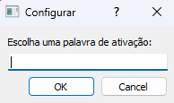
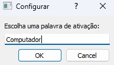
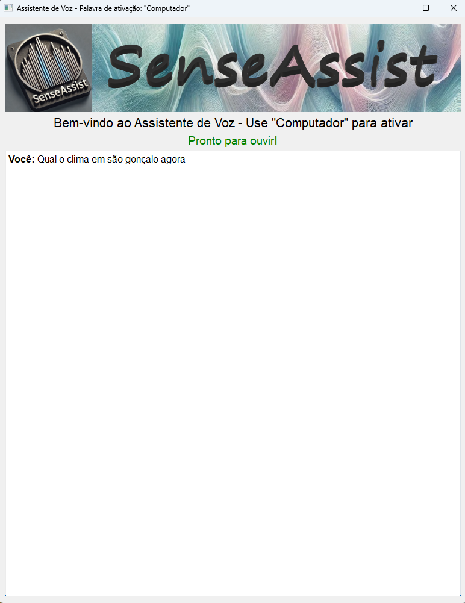
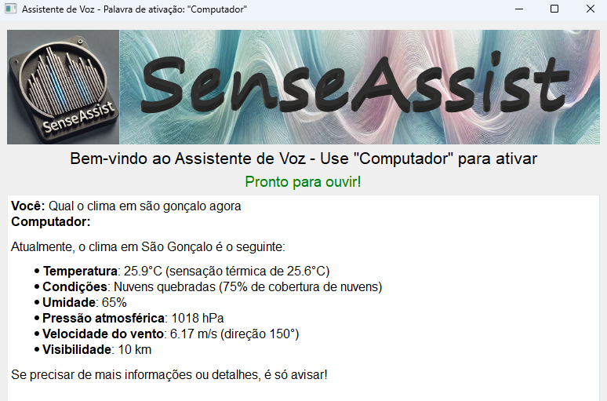

```markdown
# SenseAssist

Uma ferramenta inovadora para auxiliar pesquisa utilizando voz e inteligência artificial.

## Índice

- [Sobre o Projeto](#sobre-o-projeto)
- [Instalação](#instalação)
- [Uso](#uso)
- [Roadmap](#roadmap)
- [Contribuição](#contribuição)
- [Licença](#licença)
- [Autores](#autores)
- [Agradecimentos](#agradecimentos)

## Sobre o Projeto

SenseAssist é uma aplicação em Python que tem como objetivo ser uma ferramenta de inclusão para pessoas com algum tipo de deficiência que as impede de realizar pesquisas utilizando Inteligência Artificial. O software é especialmente útil para aqueles que têm dificuldade em ler na tela do computador ou utilizar o mouse e o teclado.

Ao iniciar o programa pela primeira vez, você será orientado a fornecer uma **palavra de ativação**.



Esta palavra permite que o programa entenda quando você está solicitando alguma informação, já que ele permanece ouvindo o tempo todo. 

Por exemplo, se a palavra de ativação escolhida for **"Computador"**, você pode dizer:

> "Computador, qual o clima atual em São Gonçalo agora?"

Ao detectar a palavra de ativação, o programa repetirá sua solicitação, escrevendo na tela e pronunciando em áudio, informando que está realizando a pesquisa solicitada. 


Após obter o resultado, ele o fornecerá escrito na tela e também o pronunciará em áudio. 


Portanto, é essencial que você tenha um microfone ativo e alto-falantes para obter os melhores resultados antes de iniciar o programa.

Os comandos são executados por voz, a informação é processada por agentes de Inteligência Artificial, que retornam exibindo o resultado na tela e realizando a leitura de forma vocal.

## Instalação

Certifique-se de ter o Python instalado em seu sistema. O projeto utiliza diversas bibliotecas que estão listadas no arquivo `requirements.txt`. Para instalar as dependências, execute:

```bash
pip install -r requirements.txt
```

As dependências incluem:

- `langflow==1.0.18`
- `SpeechRecognition==3.10.4`
- `pyttsx3==2.97`
- `PyAudio==0.2.14`
- `PyQt5==5.15.11`
- `PyQtWebEngine==5.15.7`

### Bibliotecas Utilizadas

**Langflow==1.0.18**
 - Langflow é uma ferramenta interativa para criar e ajustar fluxos de trabalho de linguagem natural. A versão 1.0.18 permite a construção de fluxos personalizados que utilizam modelos de linguagem para executar tarefas específicas. [Langflow](https://www.langflow.org/)

**SpeechRecognition**
 - Esta biblioteca permite o reconhecimento de voz em Python, facilitando a conversão de áudio em texto. [SpeechRecognition](https://pypi.org/project/SpeechRecognition/)

**pyttsx3**
 - pyttsx3 é uma biblioteca para conversão de texto em fala (TTS) offline, útil para aplicativos que precisam fornecer feedback auditivo.[pyttsx3](https://github.com/nateshmbhat/pyttsx3)

**PyAudio**
 - PyAudio é uma interface para o PortAudio, permitindo a captura e reprodução de áudio em tempo real.[PyAudio](https://people.csail.mit.edu/hubert/pyaudio/)

**PyQt5**
 - PyQt5 é um conjunto de bindings para o toolkit Qt, possibilitando a criação de interfaces gráficas de usuário sofisticadas. [PyQt5](https://www.riverbankcomputing.com/static/Docs/PyQt5/)

**PyQtWebEngine**
 - PyQtWebEngine fornece funcionalidades de navegação e exibição de conteúdo web para aplicativos PyQt5.[PyQtWebEngine](https://pypi.org/project/PyQtWebEngine/)

### Configuração das Chaves de API

**OpenAI**
 - É necessário ter uma chave de API da OpenAI. Neste projeto, utilizamos o modelo `gpt-4o-mini` configurado com `temperature=0.1` para evitar "alucinações", obtendo ótimas respostas com um baixo custo.

Crie um arquivo `.env` na raiz do projeto e adicione:

```env
OPENAI_KEY="SUA_API_KEY"
```

**Composio**
 - Utilizamos várias ferramentas de pesquisa para que o agente escolha a mais adequada para obter a resposta. O Composio permite, com a utilização de uma única chave, utilizar todos esses recursos. É necessário criar uma conta no [Composio](https://app.composio.dev/) e configurar a chave no arquivo `.env`:

```env
COMPOSIO_API_KEY="SUA_API_KEY_COMPOSIO"
```

Certifique-se de ativar as seguintes funcionalidades no Composio:

- `WEATHERMAP_WEATHER` - Ferramenta para obter o clima em qualquer cidade.
- `Wikipedia` - API para pesquisas sobre personalidades ou locais.
- `SERPAPI_DUCK_DUCK_GO_SEARCH` - Pesquisa de notícias.
- `Youtube` - Pesquisar sobre temas no YouTube.
  - `YOUTUBE_LIST_CAPTION_TRACK`
  - `YOUTUBE_SEARCH_YOU_TUBE`
  - `YOUTUBE_LOAD_CAPTIONS`
- `Gmail`
  - `GMAIL_ADD_LABEL_TO_EMAIL`
  - `GMAIL_FETCH_EMAILS`
  - `GMAIL_SEND_EMAIL`

## Uso

Após a instalação e configuração, você pode iniciar o programa executando:

```bash
python main.py
```
O programa foi testado unicamente no Windows 10 e 11, utilizando Python 3.11.5
É necessário estar conectado a internet.


Ao iniciar, siga as instruções na tela para configurar sua palavra de ativação.

## Roadmap

- [x] Implementação básica do reconhecimento de voz e síntese de fala.
- [x] Integração com APIs externas via Composio.
- [ ] Adicionar suporte para múltiplos idiomas.
- [ ] Desenvolver uma interface gráfica mais amigável.
- [ ] Otimizações de performance e uso de recursos.

## Contribuição

Fique a vontade para baixar, alterar e adicionar mais funcionalidades ao projeto.

## Licença

Este projeto está licenciado sob a licença MIT - veja o arquivo [LICENSE](LICENSE) para detalhes.

## Autores

- **Carlos Gabriel Souza Bittencourt**
- **Carlos Wagner Gonçalves Bittencourt**
- **Dyego Barros**

## Agradecimentos

Agradecemos a todos que contribuíram para este projeto e às comunidades de código aberto que possibilitam o desenvolvimento colaborativo. 
Agradecimentos especiais a #Langflow e #Composio, seria impossível a construção sem estas ferramentas.

---


```
